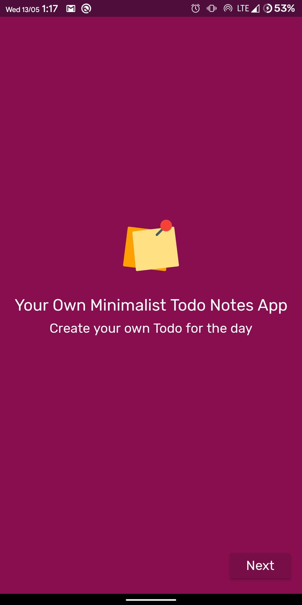
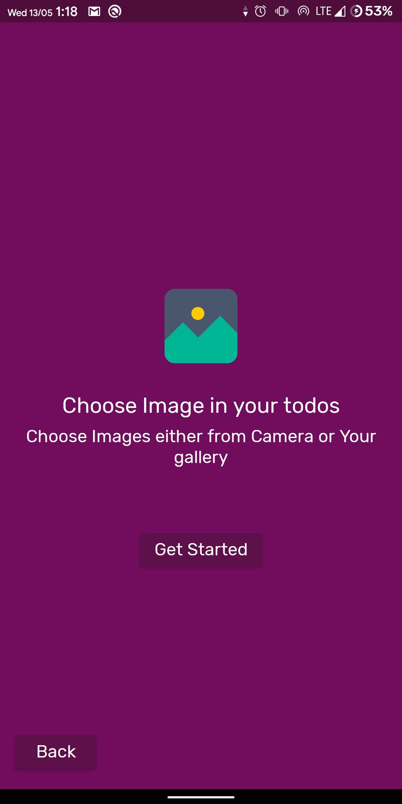
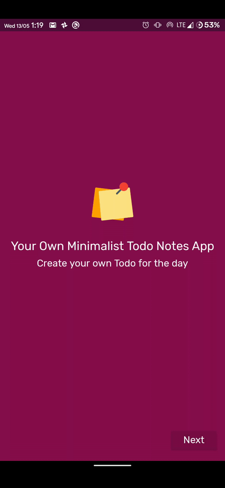
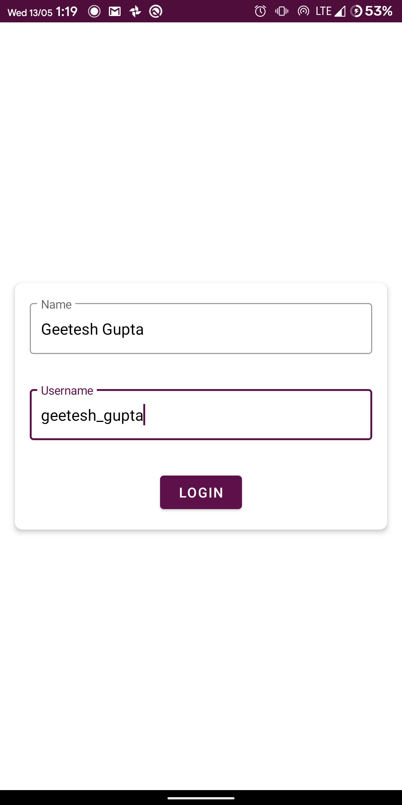
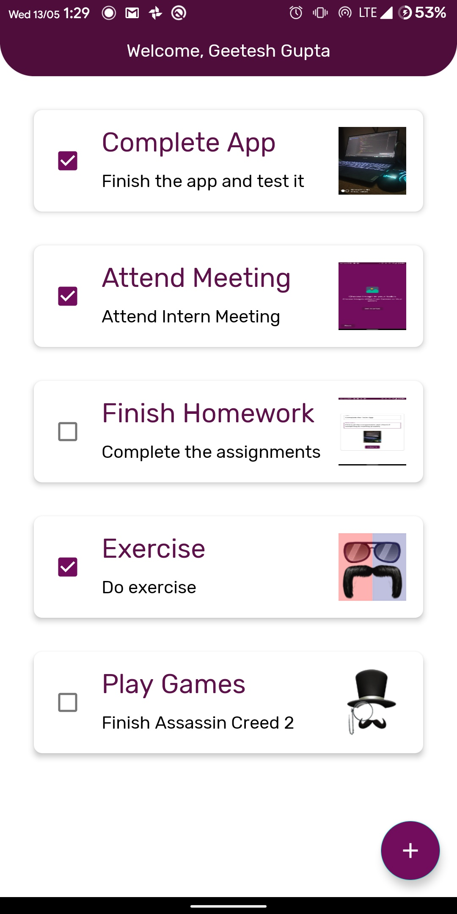
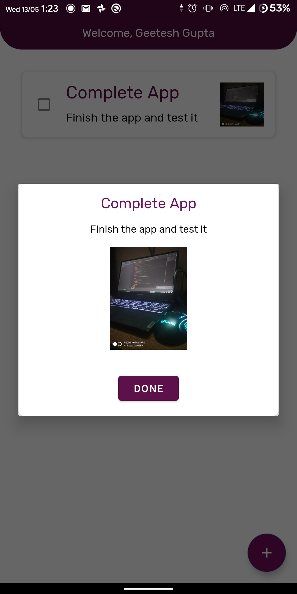

# NoteToDo
Minimalist ToDo Notes Android App in Kotlin

## Features
- Create a Todo
- Add an image to the Todo
- Mark a Todo as completed
- Minimalist Style
- Small in Size

## Screenshots
<!-- 
 -->
<table>
  <tr>
    <td>
    <td>
    <td>
  </tr>  
  <tr>  
    <td>
    <td>
    <td>
  </tr>  
</table>

## Thanks
The application has been developed as an Android course under MindOrks Droid Flight hosted by https://mindorks.com/. 
I would like to thanks Mindorks to provide such a great course with concise content and full mentorship support.
